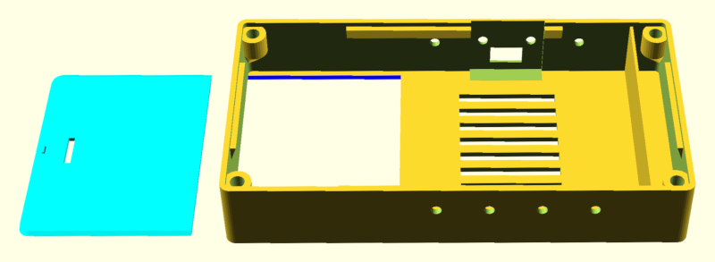
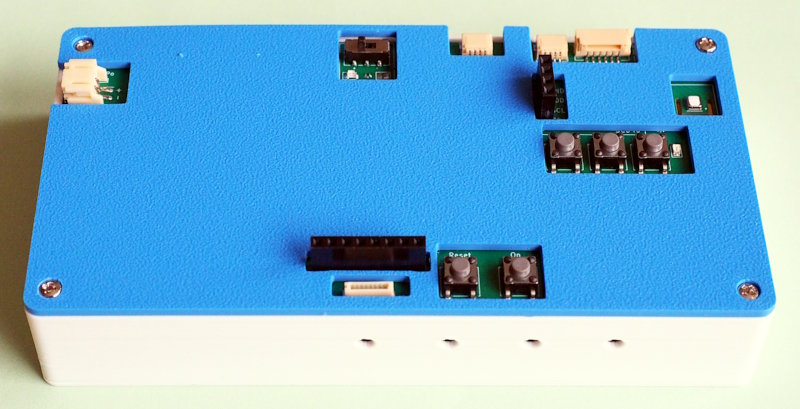
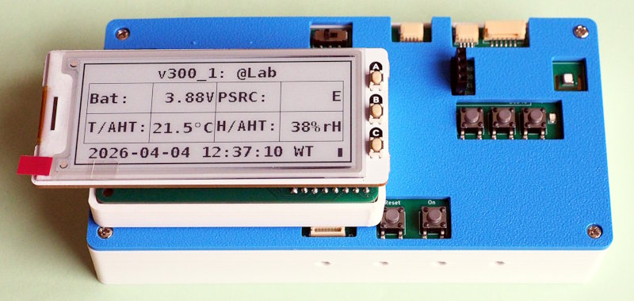

A case for the Pico-Datalogger v3
=================================

This project provides the 3D-design-files (OpenSCAD) for a case
for the Pico Datalogger (see https://github.com/bablokb/pcb-datalogger-v3).

Case with battery lid:

Assembled case with panel:

With additional display, using this [display
adapter](https://github.com/bablokb/pcb-datalogger-display-adapter-v2):

License
-------

[![CC BY-SA 4.0][cc-by-sa-shield]][cc-by-sa]

This work is licensed under a
[Creative Commons Attribution-ShareAlike 4.0 International
License][cc-by-sa].

[![CC BY-SA 4.0][cc-by-sa-image]][cc-by-sa]

[cc-by-sa]: http://creativecommons.org/licenses/by-sa/4.0/
[cc-by-sa-image]: https://licensebuttons.net/l/by-sa/4.0/88x31.png
[cc-by-sa-shield]:
https://img.shields.io/badge/License-CC%20BY--SA%204.0-lightgrey.svg
